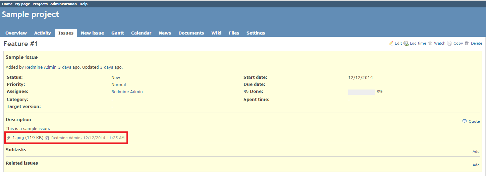

# Redmine Attachment By URL Plugin

## Description

This plugin adds **Attachments by URL** block to the issue form and enables you to attach files to issues by URL. Files are downloaded from public resources and placed into *#{REDMINE_ROOT}/attachments/download/* by the server. You can add as many files as you need when you create or edit an issue. Once the file is uploaded, it can be opened, saved or deleted in a regular way. This plugin prevents possible loss of information if the file's public URL becomes unavailable.

## Compatibility

This plugin version is compatible with Redmine 2.x only.

## Installation

1. To install the plugin
    * Download the .ZIP archive, extract files and copy the plugin directory into *#{REDMINE_ROOT}/plugins*.
    
    Or

    * Change you current directory to your Redmine root directory:  

            cd {REDMINE_ROOT}
            
      Copy the plugin from GitHub using the following commands:  
      
            git clone https://github.com/Undev/redmine_attach_by_url.git plugins/redmine_attach_by_url
        
2. Run the following commands to update the Gemfile.lock file and install the delayed_job gem:  

        rm Gemfile.lock
        bundle install

3. This plugin requires a migration. Run the following command to upgrade your database (make a database backup before):  

        bundle exec rake redmine:plugins:migrate RAILS_ENV=production

3. Restart Redmine.
4. Start the delayed_job worker gem:  

        bundle exec rake jobs:work RAILS_ENV=production

Now you should be able to see the plugin in **Administration > Plugins**.

## Usage

1. To attach a file to an issue, enter the file's URL into the corresponding field in the **Attachments by URL** block. If needed, add a description.
 
2. Wait for the file to upload.
3. To add another file, click **Add another file**.
4. To delete the attachment, click the trash bin icon. 
5. After you create the issue or submit changes to it, you can view, download or delete the attachment.

## License

Copyright (c) 2015 Undev

Licensed under the Apache License, Version 2.0 (the "License");
you may not use this file except in compliance with the License.
You may obtain a copy of the License at

http://www.apache.org/licenses/LICENSE-2.0

Unless required by applicable law or agreed to in writing, software
distributed under the License is distributed on an "AS IS" BASIS,
WITHOUT WARRANTIES OR CONDITIONS OF ANY KIND, either express or implied.
See the License for the specific language governing permissions and
limitations under the License.
